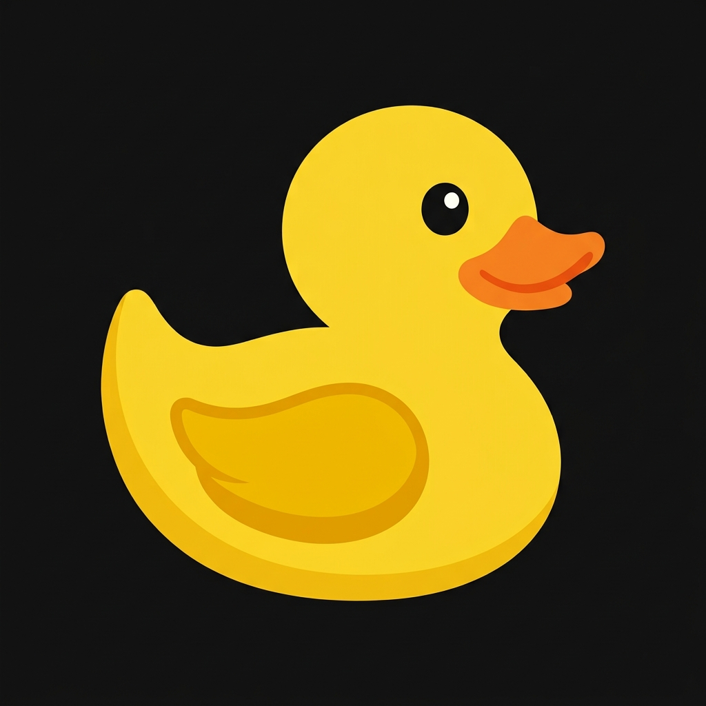

# GoDucky Website

The official website for GoDucky - the open source AI coding agent. Built with Next.js, Tailwind CSS, and deployed on Vercel.



## Features

- Modern, responsive design matching opencode.ai aesthetic
- Light / Dark / System theme toggle
- Terminal-style install command tabs (curl, npm, bun, brew, paru)
- Real waitlist email signup form with API route
- Full Privacy Policy and Terms of Service pages
- Documentation landing page
- Download page with platform-specific install commands
- Mobile-friendly navigation

## Pages

| Route | Description |
|-------|-------------|
| `/` | Home page with hero, features, stats, FAQ, waitlist |
| `/about` | About page with founder (lordpipon) info and socials |
| `/docs` | Documentation landing page |
| `/download` | Platform-specific installation commands |
| `/privacy` | Privacy Policy |
| `/terms` | Terms of Service |
| `/api/waitlist` | POST endpoint for email waitlist signup |

## Tech Stack

- **Framework:** [Next.js 14](https://nextjs.org/)
- **Styling:** [Tailwind CSS](https://tailwindcss.com/)
- **Theme:** [next-themes](https://github.com/pacocoursey/next-themes)
- **Icons:** [Lucide React](https://lucide.dev/)
- **Language:** TypeScript

## Getting Started

### Prerequisites

- Node.js 18+ (recommended: 20+)
- npm, yarn, or pnpm

### Local Development

1. Clone the repository:

```bash
git clone https://github.com/Go-Ducky/goducky-website.git
cd goducky-website
```

2. Install dependencies:

```bash
npm install
```

3. Run the development server:

```bash
npm run dev
```

4. Open [http://localhost:3000](http://localhost:3000) in your browser.

### Production Build

```bash
npm run build
npm run start
```

## Deploying to Vercel

### Option 1: Deploy via Vercel CLI

```bash
npm i -g vercel
vercel
```

### Option 2: Deploy via Git (Recommended)

1. Push your code to GitHub
2. Go to [vercel.com/new](https://vercel.com/new)
3. Import the `Go-Ducky/goducky-website` repository
4. Click **Deploy**

Vercel will automatically detect Next.js and configure build settings. No environment variables required.

## Project Structure

```
goducky-website/
├── public/
│   └── logo.jpeg
├── src/
│   ├── app/
│   │   ├── globals.css          # Design tokens (light/dark)
│   │   ├── layout.tsx           # Root layout
│   │   ├── page.tsx             # Home page
│   │   ├── about/page.tsx       # About + founder
│   │   ├── privacy/page.tsx     # Privacy Policy
│   │   ├── terms/page.tsx       # Terms of Service
│   │   ├── docs/page.tsx        # Documentation
│   │   ├── download/page.tsx    # Download page
│   │   └── api/waitlist/
│   │       └── route.ts         # Waitlist API endpoint
│   └── components/
│       ├── Header.tsx           # Sticky nav with theme toggle
│       ├── ThemeToggle.tsx      # Light/Dark/System switch
│       ├── ThemeProvider.tsx    # next-themes wrapper
│       ├── Hero.tsx             # Install tabs + banner
│       ├── Features.tsx         # Feature list
│       ├── Stats.tsx            # GitHub stats
│       ├── Privacy.tsx          # Privacy blurb
│       ├── FAQ.tsx              # Accordion FAQ
│       ├── Waitlist.tsx         # Email signup form
│       └── Footer.tsx           # Footer + legal bar
├── package.json
├── tailwind.config.js
├── postcss.config.js
├── tsconfig.json
└── next.config.js
```

## Customization

Edit CSS custom properties in `src/app/globals.css` to change the color scheme. The design tokens follow HSL values for both light and dark modes.

## License

MIT License

## Links

- [GitHub](https://github.com/Go-Ducky)
- [Website](https://goducky.dev)
